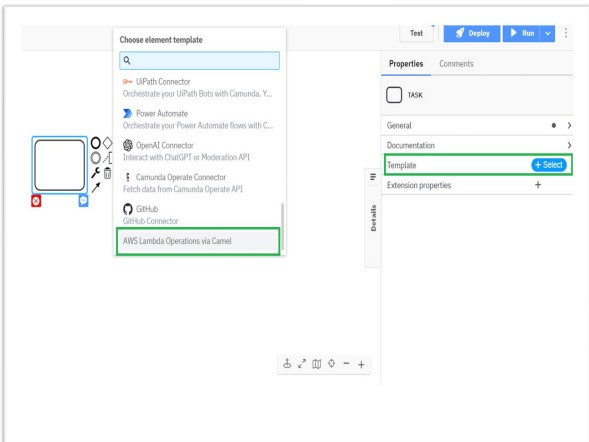
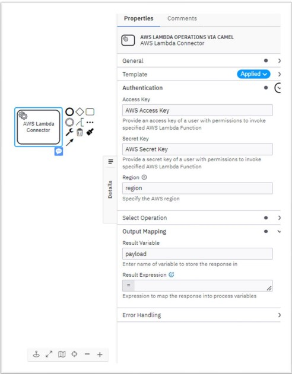
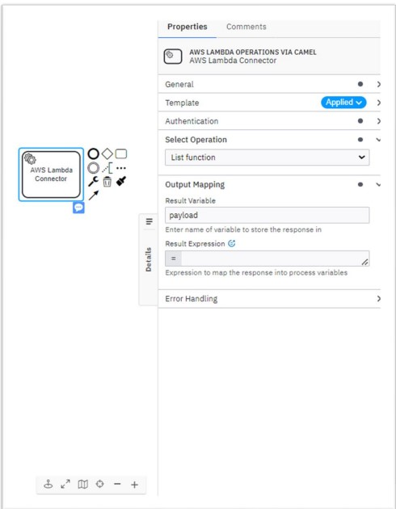
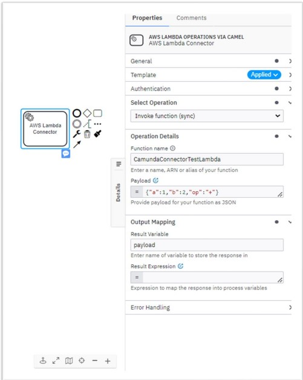
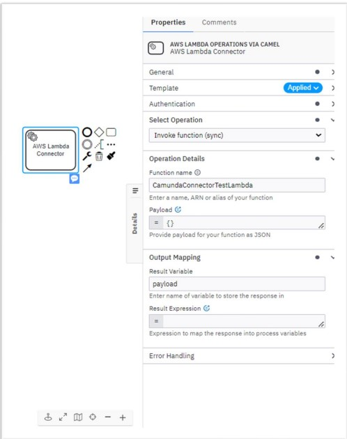

### **SUMMARY**
AWS Lambda is an event-driven, serverless computing platform provided by Amazon as a part of the Amazon Web Services. It lets you run your code in response to events and automatically manages the underlying compute resources for you.
The AWS Lambda Connector provides you the ability to interact with your Lambda functions provisioned on AWS. It allows you to manage or use the function's response payload in an effective manner.
This article will explain how to invoke AWS Lambda functions in a SaaS environment using the Amazon Lambda connector via the Apache Camel framework.
##### **PREREQUISITE**
To use an AWS Lambda Connector, you need to have an [AWS Lambda Function](https://docs.aws.amazon.com/lambda/latest/dg/welcome.html), IAM key, and secret pair with permissions for execute function. See the [AWS Lambda developer guide](https://docs.aws.amazon.com/lambda/latest/dg/lambda-permissions.html) to learn more.
The component requires the following credentials to authenticate with the AWS services:
- **AWS ACCESS KEY** - this is your Access Key ID when you created the AWS account.
- **AWS ACCESS SECRET** - this is your Secret access key given to you during the key creation.

#### **SETTING UP CONNECTOR IN THE WORKFLOW**
1. Load the connector template Json available in [location](element-templates/aws-lambda-operations-via-camel.json) into Camunda 8 (SAAS/Self-Managed)
3. To use an AWS Lambda Connector in your process, either change the type of existing task by clicking on it and using the wrench-shaped Change type context menu icon or create a new Connector task by using the Append Connector context menu. Follow our guide on using Connectors to learn more.

Please refer to the attached screenshot for further reference on  configuration.
#### **LIST FUNCTION**
This activity lists all the Lambda functions which are available for the supplied AWS credentials.
##### **CONNECTOR REQUEST**
1. Set the relevant IAM key and secret pair in the **Authentication** section. 
2. Set the relevant AWS region in the **Authentication** section.
3. In the **Select Operation** section, set the option to **List Function**.

Please refer to the attached  for further reference on configuring authentication details

##### **CONNECTOR RESPONSE**

In **Output Mapping** section,

4. Use **Result Variable** to store the response in a process variable.
5. Use **Result Expression** to map fields from the response into process variables.

Please refer to the attached  for further reference on configuring 

#### **INVOKE FUNCTION**
This action will invoke a AWS Lambda function. It has following configuration parameters:

##### **CONNECTOR REQUEST**
1. Set the relevant IAM key and secret pair in the Authentication section. 
2. Set the relevant AWS region in the Authentication section.
Please refer to the attached  for further information on configuring authentication details.
3. In the Select **Operation section**, set the option to synchronous Invoke Function; an asynchronous invocation option is currently not available.
4. In the **Operation Details** section, fill out the field **Function name**. This field can be a [function URL](https://docs.aws.amazon.com/lambda/latest/dg/lambda-urls.html?icmpid=docs_lambda_help), [function ARN](https://docs.aws.amazon.com/lambda/latest/dg/lambda-urls.html?icmpid=docs_lambda_help), function name, or alias.
5. The **Payload** field in the **Operation Details** section is optional. This field requires FEEL input. The payload must be in JSON format as this is the data that will be processed by your Lambda function.

##### **CONNECTOR RESPONSE**
In **Output Mapping** section,

6. Use **Result Variable** to store the response in a process variable.
7. Use **Result Expression** to map fields from the response into process variables.

Please refer to the attached screenshots for further reference on configuring Invoke function  and  arguments
