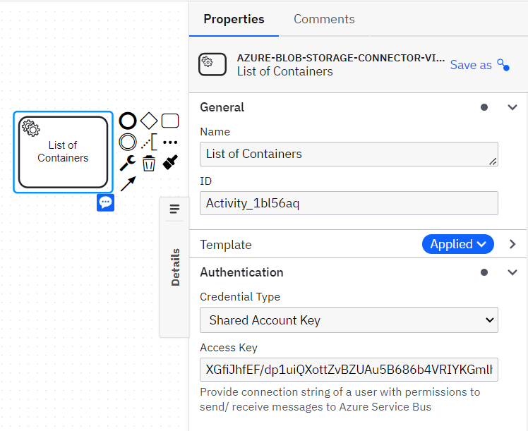

## SUMMARY
Azure Blob storage is a feature of Microsoft Azure. It allows users to store large amounts of unstructured data on Microsoft’s data storage platform.
This article will explain how to invoke Azure Blob Storage in a SaaS environment using the Azure blob storage connector via the Apache Camel framework.

#### PREREQUISITE
- An Azure account and subscription. If you don't have an Azure subscription, [sign up for a free Azure account](https://azure.microsoft.com/free/?WT.mc_id=A261C142F).
- Azure Storage account - [create a storage account](https://learn.microsoft.com/en-us/azure/storage/common/storage-account-create).
- To use Azure Blob storage Connector, you need to have a **Access Key**.

### SETTING UP CONNECTOR IN THE WORKFLOW

1.	Load the connector template Json available in [location](element-template/azure-blob-storage-connector-via-camel.json) into Camunda 8 (SAAS/Self-Managed)
2.	To use an Azure Blob Storage Connector in your process, either change the type of existing task by clicking on it and using the wrench-shaped Change type context menu icon or create a new Connector task by using the Append Connector context menu. Follow our guide on using Connectors to learn more.

Please refer to the attached  for further reference on template configuration.
 	
### Get of Blob Containers
This action will get the list of blob containers from Azure storage. It has following configuration parameters:
##### CONNECTOR REQUEST
1.	Set the relevant access key in the Authentication section.
2.	In the **Operation Details** section, fill out the field **Account Name**.
##### CONNECTOR RESPONSE
In Output Mapping section,
6.	Use Result Variable to store the response in a process variable.
7.	Use Result Expression to map fields from the response into process variables.
Please refer to the attached [screenshot](images/Azure_BlobStorage_ListBlobContainers_Configuration.png) for further reference on configuring.

### Get list of Blobs
This action will get the list of blobs available in Azure Storage container. It has following configuration parameters:
##### CONNECTOR REQUEST
1.	Set the relevant access key in the Authentication section.
2.	In the **Operation Details** section, fill out the field **Account Name**.
3.	In the **Operation Details** section, fill out the field **Container Name**.
##### CONNECTOR RESPONSE
In Output Mapping section,
6.	Use Result Variable to store the response in a process variable.
7.	Use Result Expression to map fields from the response into process variables.
Please refer to the attached [screenshot](images/Azure_BlobStorage_ListBlobs_Configuration.png) for further reference on configuring.

### Get Blob Data
This action will get blob data from Azure blob container. It has following configuration parameters:
##### CONNECTOR REQUEST
1.	Set the relevant access key in the Authentication section.
2.	In the **Operation Details** section, fill out the field **Account Name**.
3.	In the **Operation Details** section, fill out the field **Container Name**.
4.	In the **Operation Details** section, fill out the field **Blob Name**.
##### CONNECTOR RESPONSE
In Output Mapping section,
6.	Use Result Variable to store the response in a process variable.
7.	Use Result Expression to map fields from the response into process variables.
Please refer to the attached [screenshot](images/Azure_BlobStorage_GetBlob_Configuration.png) for further reference on configuring.

### Upload Block Blob Data
This action will upload block blob data into Azure Storage. It has following configuration parameters:
##### CONNECTOR REQUEST
1.	Set the relevant access key in the Authentication section.
2.	In the **Operation Details** section, fill out the field **Account Name**.
3.	In the **Operation Details** section, fill out the field **Container Name**.
4.	In the **Operation Details** section, fill out the field **Blob Name**.
5.	In the **Operation Details** section, fill out the field **Payload**.
##### CONNECTOR RESPONSE
In Output Mapping section,
6.	Use Result Variable to store the response in a process variable.
7.	Use Result Expression to map fields from the response into process variables.
Please refer to the attached [screenshot](images/Azure_BlobStorage_UploadBlockBlob_Configuration.png) for further reference on configuring.
