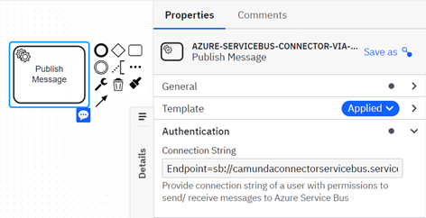

## SUMMARY
Azure Service Bus is a fully managed enterprise message broker with message queues and publish-subscribe topics (in a namespace). Also, it is a messaging service on cloud used to connect any applications, devices, and services running in the cloud to any other applications or services. As a result, it acts as a messaging backbone for applications available in the cloud or across any devices.
This article will explain how to send a message to a Azure Service Bus queue in a SaaS environment using the Azure Service bus connector via the Apache Camel framework.

#### PREREQUISITE
- An Azure account and subscription. If you don't have an Azure subscription, [sign up for a free Azure account](https://azure.microsoft.com/free/?WT.mc_id=A261C142F).
- A Service Bus namespace and messaging entity, such as a queue. For more information, review the following documentation:
    -    [Create a Service Bus namespace](https://learn.microsoft.com/en-us/azure/service-bus-messaging/service-bus-create-namespace-portal)
    -    [Create a Service Bus namespace and queue](https://learn.microsoft.com/en-us/azure/service-bus-messaging/service-bus-quickstart-portal)
    -    [Create a Service Bus namespace and topic with subscription](https://learn.microsoft.com/en-us/azure/service-bus-messaging/service-bus-queues-topics-subscriptions)

To use an Azure service bus Connector, you need to have a **connection string**. Refer [Service Bus messaging](https://learn.microsoft.com/en-us/azure/service-bus-messaging/service-bus-java-how-to-use-topics-subscriptions?tabs=connection-string) for more info

### SETTING UP CONNECTOR IN THE WORKFLOW

1.	Load the connector template Json available in [location](element-template/azure-servicebus-connector-via-camel.json) into Camunda 8 (SAAS/Self-Managed)
2.	To use an Azure service bus Connector in your process, either change the type of existing task by clicking on it and using the wrench-shaped Change type context menu icon or create a new Connector task by using the Append Connector context menu. Follow our guide on using Connectors to learn more.

Please refer to the attached  for further reference on template configuration.
 	
### SEND MESSAGE TO QUEUE
This action will send a message to queue an Azure Service Bus. It has following configuration parameters:
##### CONNECTOR REQUEST
1.	Set the relevant connection string in the Authentication section.
2.	In the Select **Operation Details** section, set the **Service bus type** option to **Queue**; **Topic** option is currently not implemented.
3.	In the **Operation Details** section, fill out the field **Queue name**. 
4.	In the **Operation Details** section, set the **Producer operation type** option to **Send Messages**; **Schedule Messages** option is currently not implemented.
5.	The **Message** field in the Operation Details section is the message that will be sent to Azure Service bus. This field requires FEEL input. The data can be any kind of information, including structured data encoded with the common formats such as the following ones: JSON, XML, Apache Avro, Plain Text.
##### CONNECTOR RESPONSE
In Output Mapping section,
6.	Use Result Variable to store the response in a process variable.
7.	Use Result Expression to map fields from the response into process variables.
Please refer to the attached [screenshot](images/Azure_Servicebus_Producer_SendMessage.png) for further reference on configuring.
